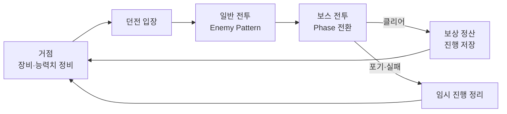
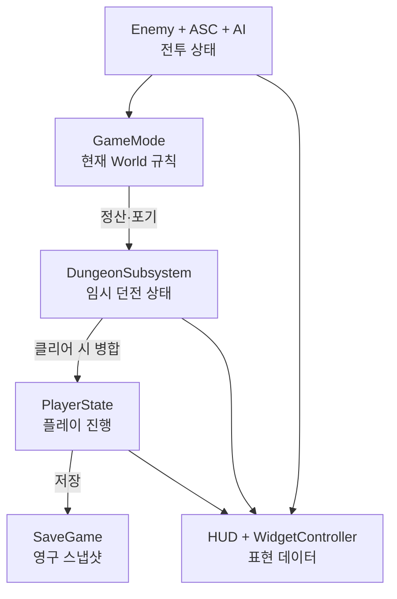
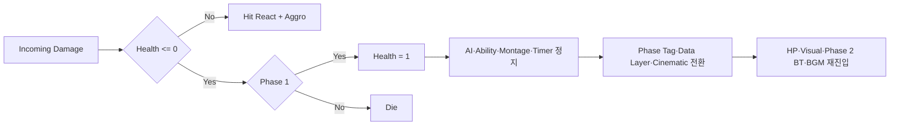
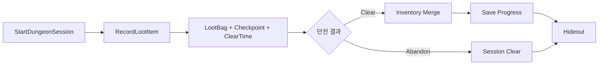

# Project Hawnmun

> 거점에서 장비를 준비하고, 던전에 진입해 전투와 보스전을 거친 뒤 보상을 정산하는 흐름을 하나의 플레이 루프로 연결한 **Unreal Engine 5.7 / C++ 기반 싱글 플레이 3D 액션 RPG**입니다.

## 프로젝트 개요

| 항목 | 내용 |
| --- | --- |
| 개발 기간 | 2026.03–2026.06 |
| 개발 인원 | 6인 팀 |
| 담당 역할 | 팀장 / 메인 프로그래머 |
| 엔진 | Unreal Engine 5.7 |
| 구현 | C++ / Blueprint |
| 장르 | Third-Person Action RPG |

이 프로젝트에서 강조하는 것은 기술 사용 개수가 아니라, 서로 다른 수명의 상태와 시스템을 실제 플레이 흐름 안에서 연결한 경험입니다.

- `Gameplay Ability`의 실제 종료 시점과 `Behavior Tree`를 동기화한 Enemy Runtime
- 치명 피해를 기준으로 AI·전투·환경·시네마틱·BGM을 전환한 Boss Phase
- 클리어 전 전리품을 임시 상태로 보관하고 성공 정산과 포기를 분리한 Dungeon Session
- Runtime 상태를 `WidgetController`가 UI 표현 데이터로 변환하는 구조

---

## 플레이 루프



| 구간 | 플레이 결과 | 구현·연결 범위 |
| --- | --- | --- |
| 거점 | 장비·능력치 정비와 저장 상태 확인 | `PlayerState` · Inventory · UI · `SaveGame` |
| 일반 전투 | 감지부터 패턴 실행과 종료까지 반복 | `AIController` · BTTask · GAS |
| 보스전 | 첫 치명 피해에서 Phase 2 장면과 전투로 전환 | AI · Ability · Data Layer · Cinematic · BGM |
| 정산 | 클리어 보상 반영 또는 포기 처리 | `DungeonSubsystem` · Inventory · Save |

---

## 상태 수명에 따른 책임 분리

기능 이름보다 **상태가 언제 생성되고, 언제 확정되며, 언제 폐기되는지**를 기준으로 소유 객체를 나눴습니다.

| 상태 | 소유 객체 | 유효 범위 | 종료·확정 조건 |
| --- | --- | --- | --- |
| 진행·장비·능력치 | `PlayerState` / `SaveGame` | 플레이 세션 / 저장 슬롯 | 저장 시 영구 확정 |
| 전리품·체크포인트·클리어 시간 | `DungeonSubsystem` | 던전 입장부터 정산·포기까지 | Session 종료 시 정리 |
| 전투 집계·BGM·레벨 이동 | `GameMode` | 현재 World | 맵 이동 또는 World 종료 |
| Target·활성·사망 | Enemy / `AIController` | Enemy 전투 | 사망 또는 Reset |
| Boss Phase | `NineTailed` / ASC Tag | Boss Encounter | 사망 또는 Phase Reset |
| 화면 표현 데이터 | HUD / `WidgetController` | 현재 HUD | HUD 또는 World 종료 |



---

## 1. Ability 종료 신호와 Behavior Tree 동기화

### 문제

고정 `Wait`로 공격 Task를 종료하면 Montage 또는 Ability 길이가 바뀔 때 AI의 다음 행동 시점과 실제 공격 종료 시점이 어긋납니다. Abort된 Task의 Delegate가 남으면 종료된 Task로 Callback이 들어올 수도 있습니다.

### 설계

`UBTTask_ActivateAbilityByTag`가 Ability를 실행하기 전에 `AbilitySystemComponent::OnAbilityEnded`를 구독하고, 요청한 Tag의 Ability가 실제로 종료됐을 때만 `FinishLatentTask()`를 호출하도록 구성했습니다.

```text
BTTask 실행
  -> OnAbilityEnded 구독
  -> Ability Tag로 활성화 요청
  -> Gameplay Ability 종료
  -> 요청 Tag 일치 확인
  -> Delegate 해제
  -> BTTask 완료
```

활성화 실패, 동기 종료, Abort, `OnTaskFinished` 경로에서도 Delegate Handle을 정리해 종료된 Task의 중복 Callback을 방지했습니다.

### 적용 범위

현재는 요청 Tag와 일치하는 Ability 종료를 Success로 처리합니다. 취소와 정상 종료를 다른 BT 결과로 나눠야 하는 패턴에는 `AbilityEndedData.bWasCancelled` 분기가 추가로 필요합니다.

---

## 2. 전투·연출·환경을 연결한 Boss Phase

구미호 보스는 Phase 1의 첫 치명 피해를 즉시 사망으로 처리하지 않고 Phase 전환 신호로 소비합니다.



| 단계 | 구현 진입점 | 플레이 결과 |
| --- | --- | --- |
| 치명 피해 가로채기 | `AttributeSet::HandleIncomingDamage()` | Phase 1의 첫 치명 피해를 전환으로 소비 |
| 전투 정지 | `StopNineTailedCombatLogic()` | AI·Movement·Montage·Ability·Timer가 연출과 충돌하지 않음 |
| 환경·연출 전환 | Data Layer + Cinematic Request | 공간과 장면이 Phase 2 상태로 전환 |
| 전투 재진입 | `EnterPhase2()` | 체력·외형·Behavior Tree·BGM 갱신 |
| 재시도 | `ResetToSpawnPoint()` | Phase 1 상태와 Behavior Tree로 복귀 |

Phase 2 Tag가 이미 존재하면 전환 함수가 실패하도록 해 두 번째 치명 피해는 정상 사망으로 이어집니다.

---

## 3. 클리어 전 보상을 분리한 Dungeon Session

던전에서 획득한 전리품은 즉시 영구 Inventory에 넣지 않고 `DungeonSubsystem`의 `SessionLootBag`에 보관합니다.



| 결과 | 처리 |
| --- | --- |
| 클리어 | `CompleteDungeonClear()`에서 전리품을 Inventory에 병합한 뒤 진행 저장 |
| 포기 | 영구 Inventory에 병합하지 않고 Session 상태를 정리한 뒤 거점 이동 |
| 사망·재시도 | Session에 저장한 Checkpoint Transform을 리스폰 기준으로 사용 |

이 구조로 **던전 안에서만 유효한 진행**과 **클리어 이후 영구 확정되는 진행**을 분리했습니다.

---

## 4. Runtime 상태를 UI로 전달하는 WidgetController

Widget이 Gameplay 객체를 직접 탐색하지 않도록 HUD가 `WidgetController`를 생성하고 필요한 객체를 주입합니다. Controller는 Runtime Delegate를 UI용 Event로 변환하고, Widget은 전달된 데이터의 표현만 담당합니다.

특히 Inventory UI는 Widget 구조를 복제하지 않고 현재 상태에 따라 데이터 출처만 전환합니다.

```text
일반 필드      -> InventoryComponent -> InventoryWidgetController -> Slot Widget
Dungeon Session -> SessionLootBag     -> InventoryWidgetController -> Slot Widget
```

초기 상태는 Broadcast하고 이후 변경은 Delegate로 전달해 매 Frame Gameplay 값을 조회하지 않도록 구성했습니다.

---

## 주요 코드 진입점

| 클래스·파일 | 역할 |
| --- | --- |
| `HawnmunGameplayTags` | Ability·상태·Boss Pattern·BGM 식별 Tag |
| `HawnmunAbilitySystemComponent` | Gameplay Ability 실행과 상태 연결 |
| `BTTask_ActivateAbilityByTag` | Ability 수명과 Behavior Tree Task 동기화 |
| `HawnmunEnemy` | Enemy 활성·감지·사망·Reset 공통 흐름 |
| `HawnmunNineTailed` | Phase 전환과 Phase별 전투 상태 |
| `HawnmunDungeonSubsystem` | 임시 Loot·Checkpoint·Dungeon Session |
| `HawnmunGameModeBase` | 레벨 이동·정산·저장·리스폰·BGM |
| `HawnmunHUD` / `WidgetController` | Runtime 데이터를 UI 표현 데이터로 중계 |

---

## 주요 맵

| 맵 | 용도 |
| --- | --- |
| `TitleMap` | 타이틀과 게임 진입 |
| `OpeningMap` / `FirstStartMap` | 최초 시작 흐름 |
| `HideoutMap` | 장비 정비와 던전 선택 |
| `Dungeon_01` / `Dungeon_01_WP` | 던전 전투와 보스전 |
| `SandBoxMap` | 전투·AI·UI 개별 검증 |

---

## 개발 환경

- Unreal Engine 5.7
- Visual Studio 2022
- Gameplay Ability System
- Enhanced Input
- Behavior Tree / AI Perception
- Motion Warping
- UMG
- Niagara / Media Framework / World Partition Data Layer

저장소는 포트폴리오 검토를 위한 프로젝트 구조와 구현 코드를 포함합니다. 외부 에셋 또는 Marketplace Plugin은 라이선스와 설치 환경에 따라 별도 준비가 필요할 수 있습니다.

## 라이선스

Copyright (c) 2026 Project Hawnmun. All rights reserved.
